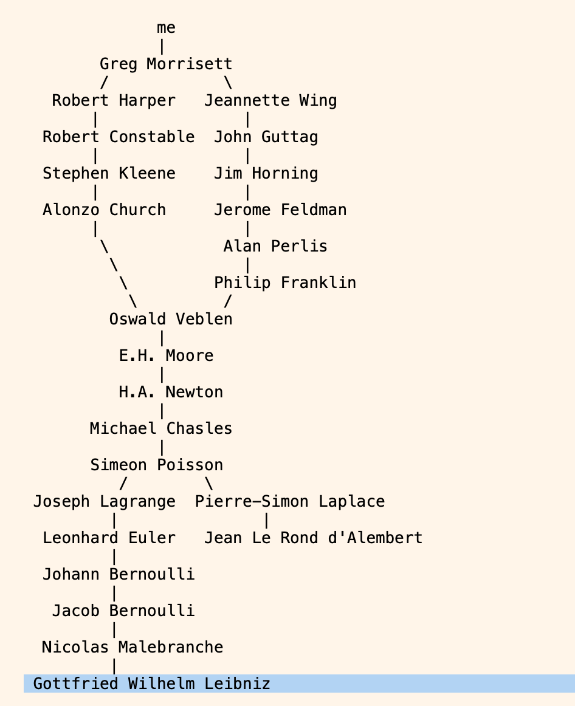

This course is a series of lectures by Dan Grossman - University of Washington. Who is Dan Grossman and why is this important, you ask? Simple. I didn't know who Dan Grossman was too. But then I visited his personal web page and found this: 

He knows who Leibniz and Malebranche are. Do you need reasons other than these?

